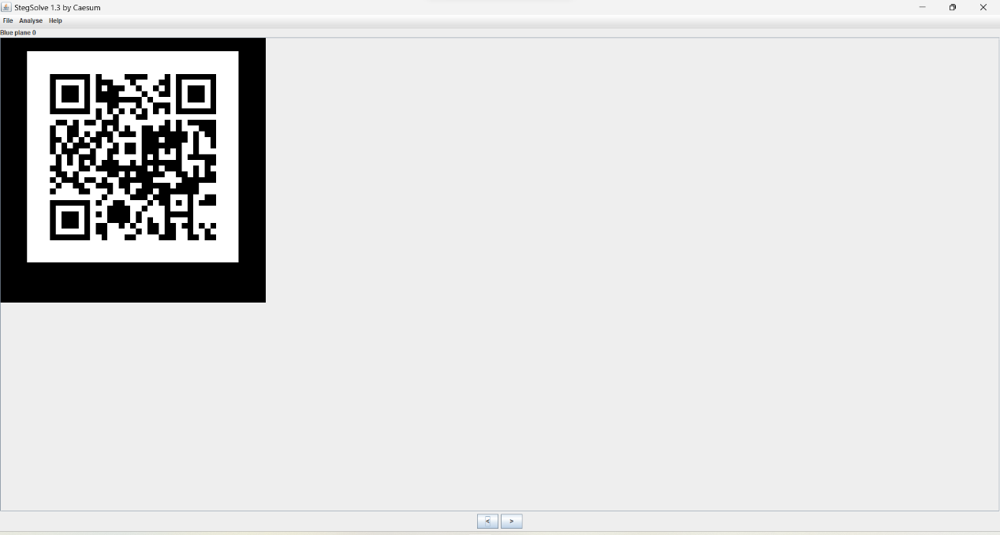

# bear的头像

## 题面

*by MiaoTony.*

熊熊可爱捏！

## 分发的文件

目录下的这个 zip

原图是 1.jpg

题目是 bear.png

## Writeup

基础入门的图片隐写题

用 Stegsolve 打开附件，一直点右箭头或者敲键盘 右 键，在 Blue plane 0 可以得到二维码

扫码可得 flag

`catctf{secR37s_In_14y#rs}`
